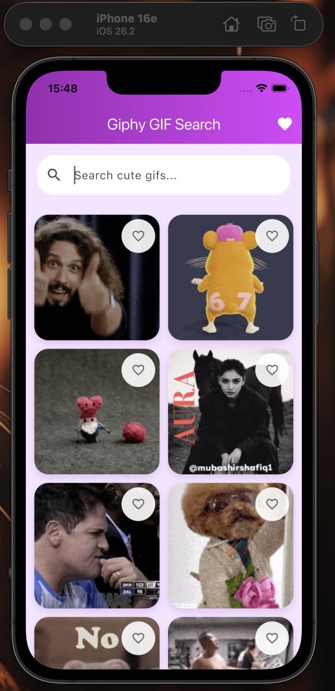
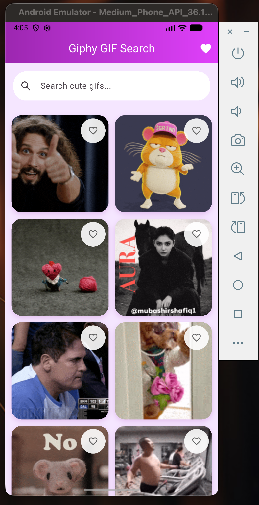
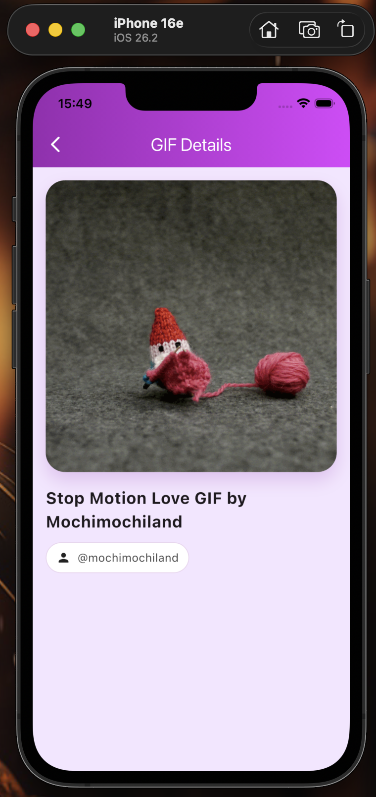
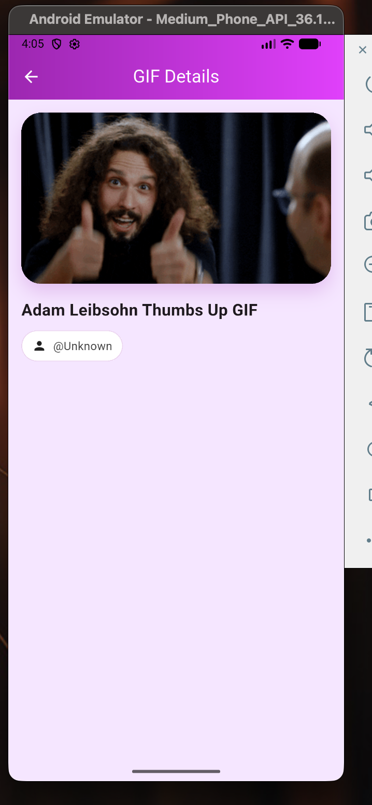
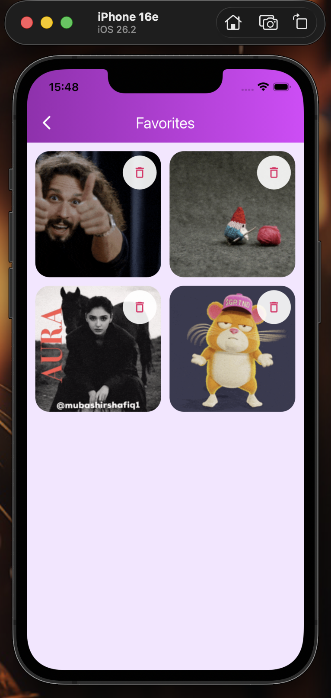
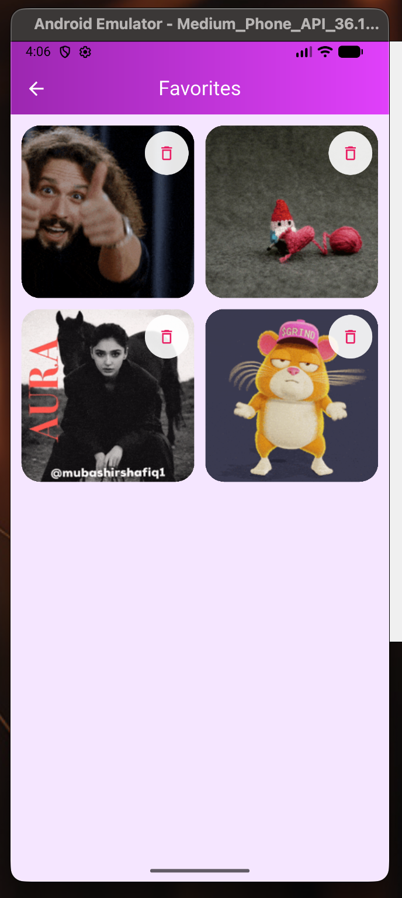
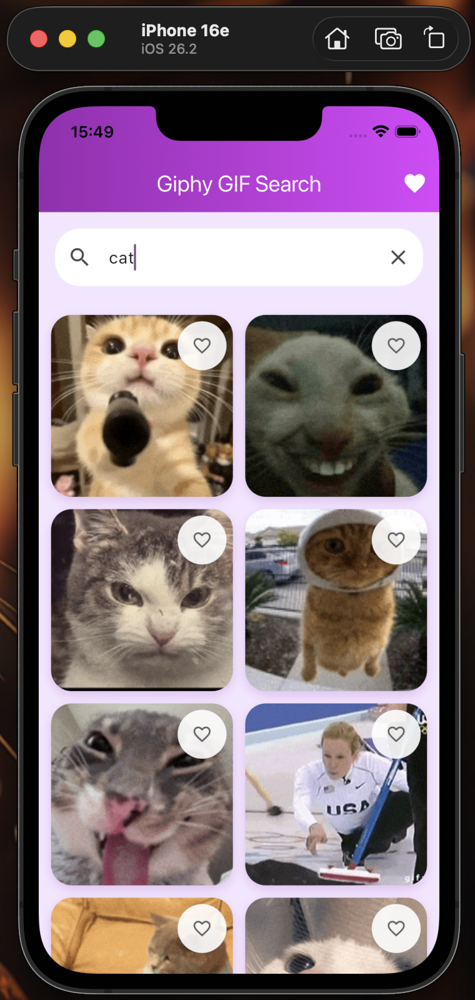
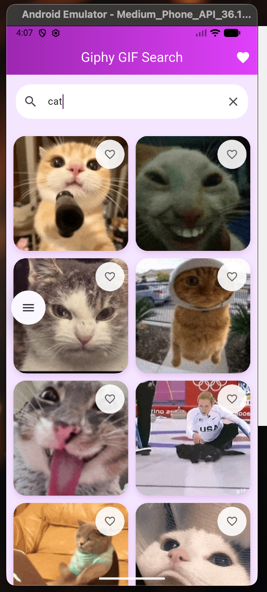
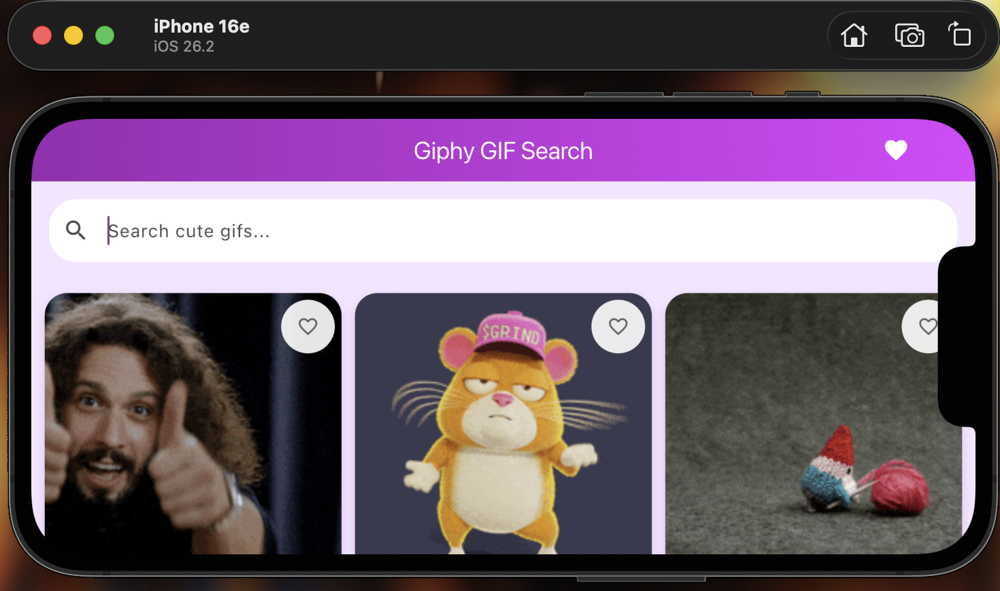
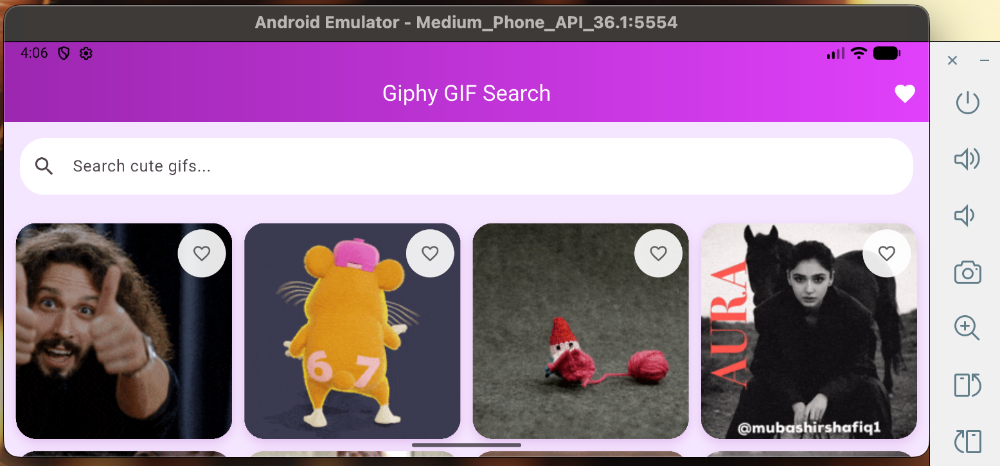

# Giphy GIF Search App

Test task for **Junior Mobile Developer (Chili Labs)**

## Overview

Flutter app for searching and exploring GIFs using the **Giphy API**.

The project demonstrates:

- clean architecture
- Riverpod state management
- pagination
- error handling
- favorites persistence
- connectivity handling

---

## Features

- Search GIFs by keyword
- Trending GIFs on app start
- Infinite scrolling (pagination)
- Add / remove favorites (persisted locally)
- GIF details screen with Hero animation
- Offline state handling (Connectivity Plus)
- Image caching (CachedNetworkImage)

---

## Tech Stack

- Flutter / Dart
- Riverpod
- Dio
- GoRouter
- CachedNetworkImage
- SharedPreferences
- Connectivity Plus

---

## Project Structure (Clean Architecture)

- `lib/app` — app setup, router, scroll behavior
- `lib/core` — common utilities, network, constants

- `lib/features/gifs`

  - `data`
    - API (Giphy API client)
    - repository (data layer abstraction)
    - models (GifModel)
  - `favorites`
    - local storage (SharedPreferences)
  - `presentation`
    - controllers (Riverpod state management)
    - pages (UI screens)
    - widgets (UI components)
  - `gifs_providers.dart` — dependency injection & providers

- `lib/main.dart` — app entry point

---

## Getting Started

### 1. Clone repository

```bash
git clone https://github.com/YOUR_USERNAME/giphy_gif_search.git
cd giphy_gif_search
```

### 2. Install dependencies

```bash
flutter pub get
```

### 3. Add your Giphy API key

**Option A (simple): local file**
Create file:
lib/core/constants/api_key.dart
Add:
const String giphyApiKey = 'YOUR_API_KEY';
Add this file to .gitignore to avoid committing the API key.

**Option B (recommended): dart-define**

```bash
flutter run --dart-define=GIPHY_API_KEY=YOUR_API_KEY
```

### 4. Run the app

```bash
flutter run
```

## Tests

Run all tests:

```bash
flutter test
```

### Included tests:

- widget_test.dart — app builds and shows title
- gif_model_test.dart — GifModel.fromJson parsing
- favorites_storage_test.dart — save/load favorites via SharedPreferences mock

## Screenshots

### Home

| iOS                                  | Android                                  |
| ------------------------------------ | ---------------------------------------- |
|  |  |

### Detailed

| iOS                                      | Android                                      |
| ---------------------------------------- | -------------------------------------------- |
|  |  |

### Favorites

| iOS                                       | Android                                       |
| ----------------------------------------- | --------------------------------------------- |
|  |  |

### Search

| iOS                                    | Android                                    |
| -------------------------------------- | ------------------------------------------ |
|  |  |

### Horizontal

| iOS                                        | Android                                        |
| ------------------------------------------ | ---------------------------------------------- |
|  |  |

---

## Author

Erika Kondratjeva
Junior Mobile Developer
